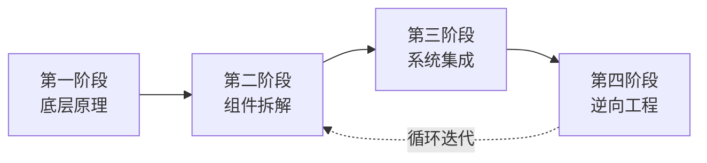

# 跨境电商 — 从零到一学习路线图

**方法论基础：Andrej Karpathy 的学习哲学**
> "The best way to learn something is to build it from scratch, understand every layer of abstraction, and then reverse-engineer the best in the field."

## 四阶段学习框架

---

### 第一阶段：底层原理（第一性原理）
> 理解跨境电商依赖的"物理定律"——贸易、货币、物流、平台经济

- 不急于选品或开店
- 先回答："这笔交易为什么能发生？钱怎么流动？货怎么到达？"
- [国际贸易基础](https://liangkx.com/explore/cross-border-ecommerce/07-international-trade-basics)
- [跨境支付与汇率](https://liangkx.com/explore/cross-border-ecommerce/08-cross-border-payments)
- [跨境物流原理](https://liangkx.com/explore/cross-border-ecommerce/09-cross-border-logistics)
- [平台经济模型](https://liangkx.com/explore/cross-border-ecommerce/10-platform-economics)

### 第二阶段：组件拆解
> 将跨境电商拆解为独立子系统，逐个深入

每个子系统像"神经网络的一层"——理解其输入、输出、内部机制：
- [选品与市场总览](https://liangkx.com/explore/cross-border-ecommerce/11-product-selection-overview)
- [平台运营总览](https://liangkx.com/explore/cross-border-ecommerce/17-platform-operations-overview)
- [流量与营销总览](https://liangkx.com/explore/cross-border-ecommerce/23-traffic-marketing-overview)
- [供应链与物流总览](https://liangkx.com/explore/cross-border-ecommerce/29-supply-chain-overview)

### 第三阶段：系统集成（从头构建）
> 像写代码一样"从零实现"一个最小可行店铺

- 选一个真实品类 → 调研 → 上架 → 获取第一单
- 每个步骤亲自动手，不用代理
- 实战项目目录：[实战项目索引](https://liangkx.com/explore/cross-border-ecommerce/48-projects-index)

### 第四阶段：逆向工程
> 拆解成熟卖家/品牌的运营系统

- 分析其流量结构、供应链、转化漏斗
- 写分析报告，然后模仿、测试、迭代
- [案例逆向工程索引](https://liangkx.com/explore/cross-border-ecommerce/52-case-studies-index)

---

## 学习纪律

- **动手优先**：每学一个概念，做一次实操（哪怕很小）
- **教学输出**：每周末用费曼技巧写一篇总结
- **循环迭代**：跑通最小闭环后，回到第二阶段深挖薄弱环节

---
*最后更新：2026-05-12*
