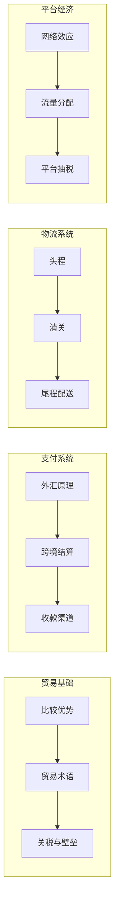

# 底层原理

> 理解跨境电商的"物理定律"——没有这些基础，所有"技巧"都是空中楼阁。

## 知识地图

## 节点

- [国际贸易基础](https://liangkx.com/explore/cross-border-ecommerce/07-international-trade-basics) — 贸易术语、比较优势、各国进口政策
- [跨境支付与汇率](https://liangkx.com/explore/cross-border-ecommerce/08-cross-border-payments) — 外汇原理、结算周期、手续费结构
- [跨境物流原理](https://liangkx.com/explore/cross-border-ecommerce/09-cross-border-logistics) — FBA/FBM/海外仓、清关流程、运费构成
- [平台经济模型](https://liangkx.com/explore/cross-border-ecommerce/10-platform-economics) — 平台为什么抽成、广告拍卖、流量分配机制

## 学习要求

每个节点看完后，**闭上书画出该主题的因果链**，直到不需要任何外部提示。
