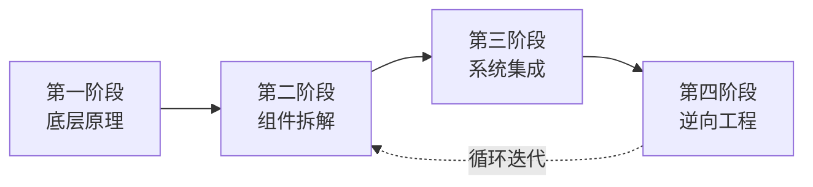

# 跨境电商 — 从零到一学习路线图

**方法论基础：Andrej Karpathy 的学习哲学**
> "The best way to learn something is to build it from scratch, understand every layer of abstraction, and then reverse-engineer the best in the field."

## 四阶段学习框架

---

### 第一阶段：底层原理（第一性原理）
> 理解跨境电商依赖的"物理定律"——贸易、货币、物流、平台经济

- 不急于选品或开店
- 先回答："这笔交易为什么能发生？钱怎么流动？货怎么到达？"
- [001-国际贸易基础](https://liangkx.com/explore/跨境电商/PART 1｜底层原理/1-国际贸易基础)
- [002-跨境支付与汇率](https://liangkx.com/explore/跨境电商/PART 1｜底层原理/2-跨境支付与汇率)
- [003-跨境物流原理](https://liangkx.com/explore/跨境电商/PART 1｜底层原理/3-跨境物流原理)
- [004-平台经济模型](https://liangkx.com/explore/跨境电商/PART 1｜底层原理/4-平台经济模型)

### 第二阶段：组件拆解
> 将跨境电商拆解为独立子系统，逐个深入

每个子系统像"神经网络的一层"——理解其输入、输出、内部机制：
- [02-选品与市场/0-选品总览](https://liangkx.com/explore/跨境电商/PART 2｜选品与市场/0-选品总览)
- [03-平台运营/0-平台运营总览](https://liangkx.com/explore/跨境电商/PART 3｜平台运营/0-平台运营总览)
- [04-流量与营销/0-流量营销总览](https://liangkx.com/explore/跨境电商/PART 4｜流量与营销/0-流量营销总览)
- [05-供应链与物流/0-供应链总览](https://liangkx.com/explore/跨境电商/PART 5｜供应链与物流/0-供应链总览)

### 第三阶段：系统集成（从头构建）
> 像写代码一样"从零实现"一个最小可行店铺

- 选一个真实品类 → 调研 → 上架 → 获取第一单
- 每个步骤亲自动手，不用代理
- 实战项目目录：[08-实战项目/0-实战项目总览](https://liangkx.com/explore/跨境电商/PART 8｜实战项目/0-实战项目总览)

### 第四阶段：逆向工程
> 拆解成熟卖家/品牌的运营系统

- 分析其流量结构、供应链、转化漏斗
- 写分析报告，然后模仿、测试、迭代
- [09-案例逆向工程/0-案例索引](https://liangkx.com/explore/跨境电商/PART 9｜案例逆向工程/0-案例索引)

---

## 学习纪律

- **动手优先**：每学一个概念，做一次实操（哪怕很小）
- **教学输出**：每周末用费曼技巧写一篇总结
- **循环迭代**：跑通最小闭环后，回到第二阶段深挖薄弱环节

---
*最后更新：2026-05-12*
