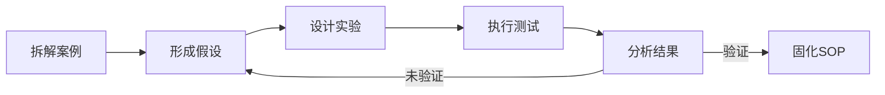

# 第四阶段：逆向工程与迭代

> 预计时间：持续进行
> 
> 核心思路：**找到最好的卖家，拆解他们的系统，模仿、测试、超越**

"Read the best papers, implement them, then improve." 在跨境电商里，最好的"论文"就是那些长期盈利的店铺和品牌。

## 逆向工程方法论

### 1. 选择分析对象
- 细分品类 Top 10 卖家
- 新锐品牌（成立 1-3 年快速增长）
- 你感兴趣品类的标杆店铺

### 2. 拆解维度

| 维度 | 分析内容 | 工具 |
|------|----------|------|
| 产品线 | SKU 数量、价格带、评分 | 手动搜索 |
| 流量来源 | 广告类型、关键词、站外渠道 | Brand Analytics |
| 供应链 | 品牌还是白牌？发货模式 | 产品页面 |
| 内容 | 图片质量、A+内容、视频 | 产品页面 |
| 定价策略 | 定价、优惠券、会员价 | Keepa/手动 |

### 3. 输出要求
每个案例分析回答三个问题：
- 他们做对了什么？（可复制的）
- 他们的弱点是什么？（可攻破的）
- 如果我来做，第一件事是什么？（可行动的）

## 迭代循环

## 案例索引

- [09-案例逆向工程/模板-案例拆解框架](https://liangkx.com/explore/跨境电商/PART 9｜案例逆向工程/模板-案例拆解框架)（每次分析用这个模板）
- [09-案例逆向工程/0-案例索引](https://liangkx.com/explore/跨境电商/PART 9｜案例逆向工程/0-案例索引)

---
**持续迭代**：每完成 3 个案例逆向，回到第二阶段补充对应的组件深度。
