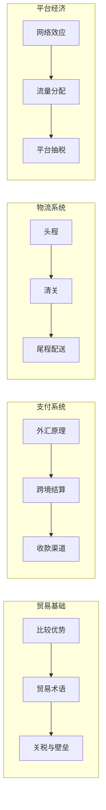

# 底层原理

> 理解跨境电商的"物理定律"——没有这些基础，所有"技巧"都是空中楼阁。

## 知识地图

## 节点

- [001-国际贸易基础](https://liangkx.com/explore/跨境电商/PART 1｜底层原理/1-国际贸易基础) — 贸易术语、比较优势、各国进口政策
- [002-跨境支付与汇率](https://liangkx.com/explore/跨境电商/PART 1｜底层原理/2-跨境支付与汇率) — 外汇原理、结算周期、手续费结构
- [003-跨境物流原理](https://liangkx.com/explore/跨境电商/PART 1｜底层原理/3-跨境物流原理) — FBA/FBM/海外仓、清关流程、运费构成
- [004-平台经济模型](https://liangkx.com/explore/跨境电商/PART 1｜底层原理/4-平台经济模型) — 平台为什么抽成、广告拍卖、流量分配机制

## 学习要求

每个节点看完后，**闭上书画出该主题的因果链**，直到不需要任何外部提示。
