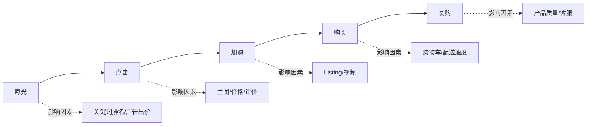

# 流量与营销总览

> 在跨境电商里，流量不是"吸引"来的——是**购买**来的，区别只在于你是用钱买还是用内容买。

## 核心认知

平台上的流量分配是一个**拍卖市场**。理解这个市场如何运作，比学任何"技巧"都重要。

## 知识节点

- [001-站内广告体系](https://liangkx.com/explore/跨境电商/PART 4｜流量与营销/1-站内广告体系) — SP（关键词广告）/ SB（品牌广告）/ SD（展示广告）
- [002-关键词研究](https://liangkx.com/explore/跨境电商/PART 4｜流量与营销/2-关键词研究) — 搜索词报告、品牌分析、关键词布局
- [003-转化率优化](https://liangkx.com/explore/跨境电商/PART 4｜流量与营销/3-转化率优化) — 从点击到购买的每一步优化
- [004-站外流量](https://liangkx.com/explore/跨境电商/PART 4｜流量与营销/4-站外流量) — 社媒、KOL、Deal站
- [005-品牌建设](https://liangkx.com/explore/跨境电商/PART 4｜流量与营销/5-品牌建设) — 从卖货到品牌的跨越

## 流量漏斗

## 关键指标

- **ACOS** = 广告花费 ÷ 广告收入
- **CTR** = 点击量 ÷ 曝光量（衡量主图+价格吸引力）
- **CVR** = 订单数 ÷ 点击量（衡量 Listing 转化能力）

## 实操清单

- [ ] 创建并优化第一个广告活动
- [ ] 完成关键词调研并输出关键词库
- [ ] 做一次 Listing 的 CVR 审计并提出优化方案

---
*相关笔记：[00-学习路线图/2-第二阶段-组件拆解](https://liangkx.com/explore/跨境电商/PART 0｜学习路线图/2-第二阶段-组件拆解)*
